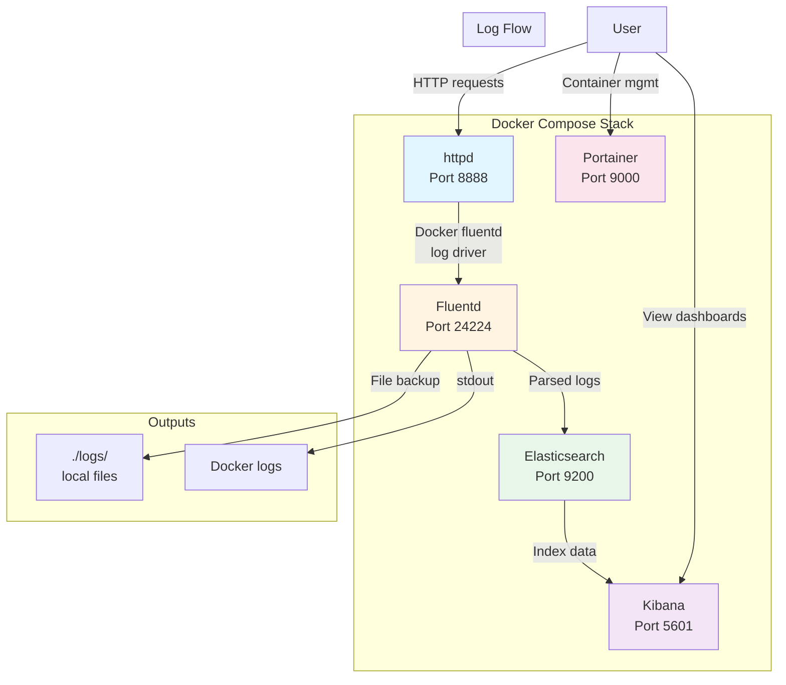

# Fluentd × Elasticsearch × Kibana (EFK Stack)

A containerised logging pipeline that collects Apache httpd access logs
via **Fluentd**, stores them in **Elasticsearch**, and visualises them in
**Kibana**.

## Architecture



## Services

| Service       | Image                                                  | Port  |
| ------------- | ------------------------------------------------------ | ----- |
| httpd         | `httpd`                                                | 8888  |
| fluentd       | custom (built from `./fluentd/Dockerfile`)             | 24224 |
| elasticsearch | `docker.elastic.co/elasticsearch/elasticsearch:7.13.1` | 9200  |
| kibana        | `docker.elastic.co/kibana/kibana:7.13.1`               | 5601  |
| portainer     | `portainer/portainer-ce:latest`                        | 9000  |

### Service Details

#### httpd

- Apache HTTP server serving test content
- Logs access events via Docker's fluentd log driver
- Exposed on port 8888
- Depends on fluentd service

#### fluentd

- Custom image based on `fluent/fluentd:v1.16.5-debian-1.0`
- Includes Elasticsearch 7.x compatible gems:
  - `elasticsearch` gem v7.17.10
  - `fluent-plugin-elasticsearch` v5.4.3
- Receives logs via forward protocol on port 24224
- Parses Apache combined log format
- Outputs to Elasticsearch, stdout, and local files

#### elasticsearch

- Single-node Elasticsearch cluster (v7.13.1)
- Health check ensures cluster is ready before dependent
  services start
- Stores parsed log data in daily indices (`fluentd-YYYYMMDD`)

#### kibana

- Kibana UI (v7.13.1) for visualising Elasticsearch data
- Connects to Elasticsearch automatically
- Pre-configured dashboards via `setup-kibana.py`

#### portainer

- Docker container management UI
- Provides web interface for monitoring containers
- Mounts Docker socket for container management

## Quick Start

### Docker Compose Deployment

#### 1. Start the stack

```bash
./runMe.sh
```

Or manually:

```bash
docker compose down --remove-orphans
docker compose up -d --build
```

#### 2. Create Kibana dashboards

Run once after the stack is up (safe to re-run - fully idempotent):

```bash
python3 setup-kibana.py
```

This script:

- Waits for Kibana to be ready
- Creates index pattern `fluentd-*`
- Creates two dashboards with visualisations
- Configures time-based queries and aggregations

#### 3. Generate test traffic

```bash
# Normal requests
for i in {1..10}; do curl -s http://localhost:8888/; done

# 404 errors
for i in {1..5}; do curl -s http://localhost:8888/not-found-$i; done
```

### Kubernetes Deployment (Helm Charts)

The project includes Helm charts for deploying the EFK stack to
Kubernetes. Each service has its own chart for modular deployment.

#### Prerequisites

- Kubernetes cluster (local or remote)
- `kubectl` configured to access your cluster
- `helm` 3.x installed
- `docker` (for building Fluentd image, if using local cluster)

#### 1. Deploy the stack

```bash
./deploy.sh
```

The deployment script will:

- Build the Fluentd Docker image
- Create Kubernetes namespace (default: `default`)
- Deploy charts in order: Elasticsearch → Fluentd → Kibana → HTTPD →
  Log Generator → Ingress
- Wait for all workloads to be ready (with health/readiness probes)
- Run smoke tests (Elasticsearch, Kibana, HTTPD) and exit with an error if
  any check fails

Customize deployment:

```bash
# Use custom release name and namespace
RELEASE_NAME=my-efk NAMESPACE=logging ./deploy.sh

# Use pre-built Fluentd image from registry
FLUENTD_IMAGE=myregistry/fluentd:latest ./deploy.sh
```

#### 2. Access services

##### Ingress (Kibana at kibana.local)

The stack deploys an Ingress so you can open Kibana at
[Kibana](http://kibana.local). You need either:

- **Local DNS**: Point `kibana.local` at the Ingress controller's
  load balancer or node IP, or
- **/etc/hosts**: Add a line such as:

  ```text
  <INGRESS_IP>  kibana.local
  ```

  Get the Ingress address with:
  `kubectl get ingress -n default` (or your namespace). For a local
  cluster (kind, minikube), use the controller's NodePort or
  `kubectl get nodes -o wide` and the node IP.

The Ingress uses `ingressClassName: nginx` by default. Ensure an
ingress controller (e.g.
[ingress-nginx](https://kubernetes.github.io/ingress-nginx/deploy/))
is installed in the cluster.

##### Port-forward (alternative)

Services are ClusterIP by default. Use port-forward to access without
Ingress. **Note:** `kubectl port-forward` runs in the foreground and
holds the terminal until you stop it (Ctrl+C).

Run in background to free the terminal:

```bash
# Set namespace (if not using default)
export NAMESPACE=default  # or your namespace

# Elasticsearch (background)
kubectl port-forward -n ${NAMESPACE} svc/efk-stack-elasticsearch \
  9200:9200 &

# Kibana (background)
kubectl port-forward -n ${NAMESPACE} svc/efk-stack-kibana \
  5601:5601 &

# HTTPD (background)
kubectl port-forward -n ${NAMESPACE} svc/efk-stack-httpd \
  8888:8888 &
```

To stop background port-forwards: `kill %1 %2 %3` or `pkill -f "port-forward"`.

#### 3. Setup Kibana dashboards

After Kibana is accessible (e.g. <http://kibana.local> or port-forward),
run the setup script:

```bash
# With port-forward to Kibana (default: http://localhost:5601)
python3 setup-kibana.py

# When using Ingress (kibana.local)
KIBANA_URL=http://kibana.local python3 setup-kibana.py
```

The script creates predefined common index patterns and the HTTP/Error
dashboards (idempotent; safe to re-run).

#### 4. Generate test traffic

```bash
# Port-forward HTTPD service first, then:
for i in {1..10}; do curl -s http://localhost:8888/; done
```

#### 5. Log Generator

The **log-generator** chart runs a pod that writes one log line to stdout
every 5 seconds. Fluentd (DaemonSet) tails node container logs and
forwards them to Elasticsearch, so these messages appear in Kibana.

- Deployed automatically by `./deploy.sh`
- Customize interval or message in `charts/log-generator/values.yaml`
  (`intervalSeconds`, `logMessage`)

##### Viewing log-generator logs in Kibana

If you do not see any data in Kibana:

1. **Create the index pattern and dashboards** (run once after the stack is up):

   ```bash
   python3 setup-kibana.py
   ```

   With Ingress: `KIBANA_URL=http://kibana.local python3 setup-kibana.py`

2. **Open Discover** in Kibana (menu: Analytics → Discover, or
   `http://localhost:5601/app/discover`).

3. **Select the index pattern** `fluentd-*` (or the default data view if the
   script set it).

4. **Set the time range** to include recent data (e.g. "Last 15 minutes" or
   "Last 24 hours") in the top-right time picker. Log-generator emits every
   5 seconds, so recent logs should appear quickly.

5. **Optional:** To see only log-generator lines, add a filter in the search
   bar: `log: *heartbeat*` or `log: *log-generator*`.

If you still see no documents, check that the log-generator pod and Fluentd
DaemonSet are running (`kubectl get pods`), and that Elasticsearch has
indices (`curl -s http://localhost:9200/_cat/indices?v`).

##### Discover: "@timestamp no longer exists"

If Discover shows *"The field @timestamp associated with this object no longer
exists in the index pattern"*, the index pattern was created before any logs
were in Elasticsearch, so its field list does not include `@timestamp`.

- **Fix 1:** Re-run the setup script so it can refresh the index pattern
  (after logs are flowing): `python3 setup-kibana.py` (or
  `KIBANA_URL=http://kibana.local python3 setup-kibana.py`).
- **Fix 2:** In Kibana go to **Stack Management** → **Index Patterns** (or
  **Data Views** in Kibana 8+) → open **fluentd-\*** → use **Refresh field
  list** (or delete the pattern and run `setup-kibana.py` again).

#### Manual Helm deployment

Deploy individual charts:

```bash
# Deploy Elasticsearch
helm upgrade --install efk-stack-elasticsearch ./charts/elasticsearch \
  --namespace default --wait

# Deploy Fluentd
helm upgrade --install efk-stack-fluentd ./charts/fluentd \
  --namespace default --wait

# Deploy Kibana
helm upgrade --install efk-stack-kibana ./charts/kibana \
  --namespace default --wait

# Deploy HTTPD
helm upgrade --install efk-stack-httpd ./charts/httpd \
  --namespace default --wait

# Deploy Log Generator (emits a log every 5 seconds, viewable in Kibana)
helm upgrade --install efk-stack-log-generator ./charts/log-generator \
  --namespace default --wait

# Deploy Ingress (Kibana at http://kibana.local)
helm upgrade --install efk-stack-ingress ./charts/ingress \
  --namespace default \
  --set kibana.serviceName=efk-stack-kibana --set kibana.servicePort=5601
```

#### Redeploy

To redeploy with updated configurations or charts, simply run the
deployment script again:

```bash
./deploy.sh
```

The script uses `helm upgrade --install`, which will:

- Upgrade existing Helm releases if they already exist
- Install new releases if they don't exist
- Rebuild the Fluentd Docker image (if Docker is available)
- Apply any changes to chart values or templates

**Note:** Redeployment will cause pods to restart. For zero-downtime
updates, ensure your charts use rolling update strategies (default
for Deployments).

#### Uninstall

To remove the stack and **all persistent data** (including the
Elasticsearch PVC), run:

```bash
./destroy.sh
```

Uses the same `RELEASE_NAME` and `NAMESPACE` as `deploy.sh` (default:
`efk-stack`, `default`). To match a custom deploy:

```bash
RELEASE_NAME=my-efk NAMESPACE=logging ./destroy.sh
```

Manual uninstall (releases only; PVCs are left behind unless deleted
separately):

```bash
helm uninstall efk-stack-elasticsearch efk-stack-fluentd \
  efk-stack-kibana efk-stack-httpd efk-stack-log-generator \
  efk-stack-ingress -n default

# Delete the Elasticsearch data PVC
kubectl delete pvc efk-stack-elasticsearch-data -n default
```

#### Chart Structure

Each chart (`charts/<service>/`) contains:

- `Chart.yaml` - Chart metadata
- `values.yaml` - Default configuration values
- `templates/` - Kubernetes manifest templates
  - `deployment.yaml` - Deployment resource
  - `service.yaml` - Service resource
  - `_helpers.tpl` - Template helpers
  - Additional resources (ConfigMaps, etc.)

#### Customizing Charts

Override values:

```bash
helm upgrade --install efk-stack-elasticsearch ./charts/elasticsearch \
  --namespace default \
  --set replicas=3 \
  --set image.tag=7.14.0
```

Or use a custom values file:

```bash
helm upgrade --install efk-stack-elasticsearch ./charts/elasticsearch \
  --namespace default \
  -f custom-values.yaml
```

## Kibana Dashboards

> Kibana UI: **`http://localhost:5601`**

| Dashboard                 | Description                                                      | Link                                                                            |
| ------------------------- | ---------------------------------------------------------------- | ------------------------------------------------------------------------------- |
| **HTTP Access Logs**      | Total requests, status codes, methods, top paths & client IPs    | [Open →](http://localhost:5601/app/dashboards#/view/dashboard-http-access-logs) |
| **HTTP Errors (4xx/5xx)** | Error count, status breakdown, errors over time, top error paths | [Open →](http://localhost:5601/app/dashboards#/view/dashboard-errors)           |

### HTTP Access Logs Dashboard

Panels included:

- **Total Requests** - metric count
- **Request Methods** - pie chart (GET / POST / HEAD …)
- **Status Code Distribution** - donut chart
- **Requests Over Time** - area chart (last 24 h)
- **Top Requested Paths** - table
- **Top Client IPs** - table

### HTTP Errors (4xx / 5xx) Dashboard

Panels included:

- **Total Error Count** - metric, colour-coded
- **Error Status Code Breakdown** - donut chart
- **Errors Over Time** - area chart (last 24 h)
- **Top Error Paths with Status Codes** - table

## Service URLs

| Service           | URL                      |
| ----------------- | ------------------------ |
| httpd (test site) | `http://localhost:8888`  |
| Elasticsearch API | `http://localhost:9200`  |
| Kibana            | `http://localhost:5601`  |
| Portainer         | `http://localhost:9000`  |

## Project Structure

```text
.
├── docker-compose.yaml        # Docker Compose stack definition
├── docker-compose-k8s.yaml    # Docker Compose for K8s conversion (no portainer)
├── runMe.sh                   # Docker Compose start script
├── deploy.sh                  # Kubernetes deployment script
├── destroy.sh                 # Teardown script (releases + PVCs)
├── setup-kibana.py            # Creates Kibana index pattern + dashboards
├── CHANGELOG.md               # Project changelog
├── .gitignore                 # Git ignore rules
├── fluentd/
│   ├── Dockerfile             # Custom fluentd image (ES 7.x compatible)
│   └── conf/
│       └── fluent.conf        # Fluentd config: parse Apache logs → ES + file
├── charts/                    # Helm charts directory
│   ├── elasticsearch/         # Elasticsearch Helm chart
│   │   ├── Chart.yaml
│   │   ├── values.yaml
│   │   └── templates/
│   ├── fluentd/               # Fluentd Helm chart
│   │   ├── Chart.yaml
│   │   ├── values.yaml
│   │   └── templates/
│   ├── httpd/                  # HTTPD Helm chart
│   │   ├── Chart.yaml
│   │   ├── values.yaml
│   │   └── templates/
│   ├── kibana/                # Kibana Helm chart
│   │   ├── Chart.yaml
│   │   ├── values.yaml
│   │   └── templates/
│   ├── log-generator/         # Log generator (emits a log every 5s)
│   │   ├── Chart.yaml
│   │   ├── values.yaml
│   │   └── templates/
│   └── ingress/               # Ingress (Kibana at kibana.local)
│       ├── Chart.yaml
│       ├── values.yaml
│       └── templates/
├── logs/                      # Fluentd file output (mounted volume)
│   └── .gitignore             # Ignore log files
└── runtime_data/              # Runtime data directory
    └── portainer-data/        # Portainer persistent data
        └── .gitignore         # Ignore runtime data
```

## Configuration Details

### Fluentd Configuration

The `fluentd/conf/fluent.conf` file defines:

1. **Input Source** (`<source>`):
   - Forward protocol listener on port 24224
   - Binds to all interfaces (0.0.0.0)

2. **Log Parser** (`<filter httpd>`):
   - Parses Apache combined log format using regex
   - Extracts fields: `host`, `user`, `method`, `path`, `code`, `size`
   - Converts `code` and `size` to integers
   - Parses timestamp from log format

3. **Outputs** (`<match **>`):
   - **Elasticsearch**: Daily indices (`fluentd-YYYYMMDD`)
   - **stdout**: Console output for debugging
   - **File**: Local backup to `./logs/` directory

4. **Internal Logs** (`<label @FLUENT_LOG>`):
   - Routes Fluentd internal logs to stdout only
   - Suppresses deprecation warnings in main output

### Kubernetes: Log Sources Collected

When deployed as a DaemonSet, Fluentd can collect all of the following
(all forwarded to Elasticsearch under the `fluentd-*` index pattern):

| Source | What is collected | Chart value |
| ------ | ----------------- | ----------- |
| **Container / pod logs** | Stdout/stderr of every container (CRI log files) | `containerLogs.enabled` |
| **Node (host) logs** | Host syslog and messages (`/var/log/syslog`, `/var/log/messages`) | `nodeLogs.enabled` |
| **Cluster / systemd journal** | Kubelet, runtime, control-plane (journald) | `journal.enabled` |
| **Forward protocol** | Apps sending to Fluentd on port 24224 (e.g. httpd log driver) | always on |

- **Container and pod logs**: Tailed from `/var/log/containers/*.log` on each node.
- **Node logs**: Tailed from host `/var/log/syslog` (Debian/Ubuntu) and
  `/var/log/messages` (RHEL/CentOS).
- **Journal**: Read via `fluent-plugin-systemd` from `/var/log/journal`
  and `/run/log/journal` (kubelet, containerd, API server, etc. when
  they log to systemd).

Enable or disable each source in `charts/fluentd/values.yaml`
(`containerLogs.enabled`, `nodeLogs.enabled`, `journal.enabled`).
The Fluentd image must be built from `./fluentd/Dockerfile` (includes
`fluent-plugin-systemd` and libsystemd).

### Kubernetes: Health and Readiness Probes

Charts define liveness and readiness probes where applicable:

| Chart | Liveness / Readiness |
| ------ | --------------------- |
| Elasticsearch | exec: cluster health (not red) |
| Kibana | httpGet /api/status |
| HTTPD | httpGet / |
| Fluentd | tcpSocket :24224 |
| Log-generator | exec: process check |

Probes can be disabled in each chart's `values.yaml` (e.g.
`healthcheck.enabled: false`).

### Kubernetes: Persistence and Log Rotation

Elasticsearch data is persisted with a **150MB** PersistentVolumeClaim
(configurable in `charts/elasticsearch/values.yaml` under
`persistence`). When the volume approaches capacity, a **CronJob**
runs every 15 minutes and deletes the **oldest** `fluentd-*` indices
until total size is under the configured limit (default 140MB), so
new logs can be written (override behavior).

- **Persistence**: `persistence.enabled`, `persistence.size` (default
  `150Mi`), optional `persistence.storageClassName`.
- **Rotation**: `rotation.enabled`, `rotation.maxSizeBytes` (default
  140MB), `rotation.indexPattern` (`fluentd-*`), `rotation.schedule`
  (default `*/15 * * * *`).

To disable persistence or rotation, set `persistence.enabled` or
`rotation.enabled` to `false` in the Elasticsearch chart values.

### Docker Compose Configuration

Key features:

- **Service Dependencies**: Uses `depends_on` with health checks
- **Volume Mounts**:
  - Fluentd config: `./fluentd/conf:/fluentd/etc`
  - Log files: `./logs/:/fluentd/logs`
  - Portainer data: `./runtime_data/portainer-data:/data`
- **Health Checks**: Elasticsearch has health check to ensure readiness
- **Logging Driver**: httpd uses Docker's fluentd log driver
- **Port Mappings**: All services expose their standard ports

### Kibana Setup Script

The `setup-kibana.py` script:

- Waits for Kibana to be ready (checks `/api/status`)
- Creates predefined common index patterns (see `COMMON_INDEX_PATTERNS` in the
  script; default: `fluentd-*` with time field `@timestamp`) and sets the
  default index pattern when supported
- Creates 9 visualisations:
  - HTTP Access Logs: 5 visualisations
  - Error Logs: 4 visualisations
- Creates 2 dashboards with pre-configured layouts
- Uses Kibana Saved Objects API
- Fully idempotent (safe to re-run)

## How Logs Flow

1. **httpd** writes access logs via Docker's `fluentd` log driver to Fluentd
   on port `24224`.

2. **Fluentd** applies an Apache combined-log regex parser (extracts `host`,
   `method`, `path`, `code`, `size`), then fans out to three outputs:
   - Elasticsearch index `fluentd-YYYYMMDD`
   - stdout (visible in `docker logs fluentd`)
   - local file under `./logs/`

3. **Kibana** reads from the `fluentd-*` index pattern to power the
   dashboards.

## Log Format

The system parses Apache combined log format:

```text
host user [timestamp] "method path protocol" code size
```

Example:

```text
192.168.1.1 - - [18/Feb/2026:10:30:45 +0000] "GET / HTTP/1.1" 200 1234
```

Parsed fields:

- `host`: Client IP address
- `user`: Remote user (usually `-`)
- `method`: HTTP method (GET, POST, etc.)
- `path`: Request path
- `code`: HTTP status code (integer)
- `size`: Response size in bytes (integer)
- `@timestamp`: Parsed timestamp

## Troubleshooting

### Docker Compose

#### Check all container statuses

```bash
docker compose ps
```

#### Tail fluentd logs

```bash
docker logs -f fluentd
```

#### View container logs

```bash
# All services
docker compose logs

# Specific service
docker compose logs fluentd
docker compose logs elasticsearch
docker compose logs kibana
```

#### Restart services

```bash
# Restart all
docker compose restart

# Restart specific service
docker compose restart fluentd
```

#### Clean up and start fresh

```bash
# Stop and remove containers, networks, volumes
docker compose down -v

# Remove orphaned containers
docker compose down --remove-orphans

# Start fresh
./runMe.sh
```

### Kubernetes

#### Check pod statuses

```bash
kubectl get pods -n default  # or your namespace

# Watch pods
kubectl get pods -n default -w
```

#### View pod logs

```bash
# Fluentd logs
kubectl logs -n default daemonset/efk-stack-fluentd -f

# Elasticsearch logs
kubectl logs -n default deployment/efk-stack-elasticsearch -f

# Kibana logs
kubectl logs -n default deployment/efk-stack-kibana -f

# HTTPD logs
kubectl logs -n default deployment/efk-stack-httpd -f
```

#### Check service endpoints

```bash
kubectl get svc -n default
kubectl get endpoints -n default
```

#### Query Elasticsearch directly

```bash
# Port-forward first
kubectl port-forward -n default svc/efk-stack-elasticsearch 9200:9200

# Then query
curl http://localhost:9200/fluentd-*/_count

curl -X GET "http://localhost:9200/fluentd-*/_search?pretty" \
  -H 'Content-Type: application/json' \
  -d '{"query": {"match_all": {}}, "size": 10}'
```

#### Check Elasticsearch indices

```bash
curl http://localhost:9200/_cat/indices?v
```

#### Debug deployment issues

```bash
# Describe pod to see events
kubectl describe pod <pod-name> -n default

# Check ConfigMap
kubectl get configmap -n default
kubectl describe configmap efk-stack-fluentd-config -n default

# Check Helm releases
helm list -n default
helm status efk-stack-elasticsearch -n default
```

#### Re-run Kibana dashboard setup

```bash
python3 setup-kibana.py
```

#### Uninstall and redeploy

```bash
# Remove everything (releases + PVCs)
./destroy.sh

# Redeploy
./deploy.sh
```

## Dependencies

### Docker Compose Stack

- Docker and Docker Compose
- Python 3 (for `setup-kibana.py`)
- Internet connection (for pulling Docker images)

### Kubernetes Deployment

- Kubernetes cluster (v1.19+)
- `kubectl` configured to access cluster
- `helm` 3.x
- `docker` (for building Fluentd image, if using local cluster)
- Python 3 (for `setup-kibana.py`)
- Internet connection (for pulling container images)

## Version Information

- Fluentd: v1.16.5-debian-1.0
- Elasticsearch: 7.13.1
- Kibana: 7.13.1
- Elasticsearch gem: 7.17.10
- Fluent-plugin-elasticsearch: 5.4.3

## Notes

- Elasticsearch uses single-node discovery mode (suitable for development)
- Log files are stored locally in `./logs/` directory
- Kibana dashboards are created programmatically and can be recreated
- All services restart automatically unless stopped manually
- Portainer provides container management UI for monitoring
